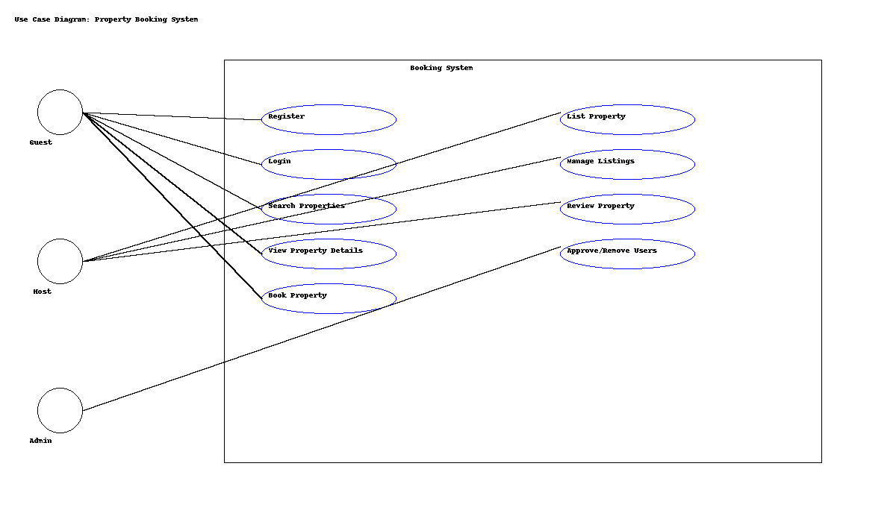

 # Requirement Analysis in Software Development

## 🔍 Introduction

This repository is dedicated to exploring **Requirement Analysis**, a fundamental phase of the Software Development Life Cycle (SDLC).

Requirement Analysis helps gather, document, and prioritize the needs of stakeholders to ensure the final product is both functional and user-focused. In this repo, you'll find:

- 📌 Definitions and types of requirements (functional & non-functional)
- 🛠️ Tools and techniques for requirement elicitation
- ✅ Examples of use case diagrams, user stories, and validation techniques
- 💡 Real-world application in project planning and design

This is part of the ALX Software Engineering curriculum to build strong foundations in planning software systems effectively.

 What is Requirement Analysis?
Requirement Analysis is a critical phase in the Software Development Life Cycle (SDLC) where stakeholders' needs, expectations, and objectives are identified, gathered, analyzed, documented, and validated. It acts as the foundation for all subsequent development activities, ensuring that the final software solution aligns with business goals and user expectations.

📌 Why is Requirement Analysis Important?
Clarifies Stakeholder Needs
Requirement analysis helps bridge the gap between users (non-technical) and developers (technical) by defining what the software should do.

Reduces Risk of Failure
By identifying the correct requirements early, teams can avoid costly rework, delays, or project failure.

Improves Project Planning
Well-defined requirements allow for better estimation of cost, time, and resources.

Ensures Testability and Traceability
Each requirement can be traced and tested to ensure it has been implemented correctly.

🔍 Key Activities in Requirement Analysis
Requirement Elicitation: Gathering requirements from stakeholders using interviews, surveys, workshops, etc.

Requirement Documentation: Creating artifacts such as Software Requirement Specifications (SRS), user stories, and use case diagrams.

Requirement Validation: Ensuring all documented requirements are accurate, complete, and agreed upon by stakeholders.

Requirement Prioritization: Determining which features or functions are most critical to deliver value early.

🧩 Types of Requirements
Functional Requirements: What the system should do (e.g., user registration, data processing).

Non-Functional Requirements: How the system should perform (e.g., performance, security, usability).

✅ This phase is essential to building software that works — not just technically, but also from a user and business perspective.

## 🗂️ Use Case Diagrams

### 📌 What are Use Case Diagrams?

Use Case Diagrams are a type of UML (Unified Modeling Language) diagram used in **Requirement Analysis** to visually represent the interactions between users (**actors**) and the system (**use cases**). They provide a high-level overview of how different users interact with the functionalities of a system.

---

### ✅ **Benefits of Use Case Diagrams**

- Clarify system functionality from the user’s perspective  
- Help identify system boundaries and external actors  
- Improve communication between stakeholders and developers  
- Serve as a reference during design and testing phases

---

### 💼 Use Case Diagram: Booking System

Below is a simple use case diagram for a **Property Booking System**, showing the interactions between users and the system's core features.

---

### 🧍‍ Actors:
- **Guest**: Can register, log in, search for properties, book a property, and leave reviews.  
- **Host**: Can log in, list properties, manage bookings, and respond to reviews.  
- **Admin**: Manages user accounts and oversees system operations.

---

### 🔄 Use Cases:
- Register
- Login
- Search Properties
- View Property Details
- Book Property
- List Property
- Manage Listings
- Review Property
- Approve/Remove Users

📌 What is Acceptance Criteria?
Acceptance Criteria are the conditions that a software product must satisfy to be accepted by the end user, customer, or stakeholders. They define the boundaries of a user story or feature and provide clear guidelines on what needs to be implemented for a requirement to be considered “done.”

In Requirement Analysis, acceptance criteria serve as a critical bridge between requirements and testing. They ensure:

The development team understands exactly what to build.

The QA team knows what to test and validate.

Stakeholders can verify that the delivered functionality meets expectations.

🎯 Why is Acceptance Criteria Important?
✅ Removes ambiguity: Clearly defines what is expected of a feature.

🧪 Improves testability: Helps create precise test cases to validate features.

🔁 Facilitates communication: Aligns developers, designers, testers, and stakeholders.

📦 Defines "Done": Provides a measurable standard to know when a task or story is complete.

💼 Example: Acceptance Criteria for a "Checkout" Feature in a Booking System
User Story:
As a guest, I want to be able to check out of a booked property so that I can complete my stay and leave feedback.

Acceptance Criteria:

✅ The system must display a “Checkout” button for all active bookings.

✅ Upon clicking the button, a confirmation modal should appear.

✅ Once confirmed, the booking status must change to “Checked Out.”

✅ The guest must receive a confirmation email within 5 minutes.

✅ A prompt to leave a review should be shown after successful checkout.

✅ By clearly defining what success looks like for each feature, acceptance criteria reduce miscommunication and ensure high-quality outcomes.
